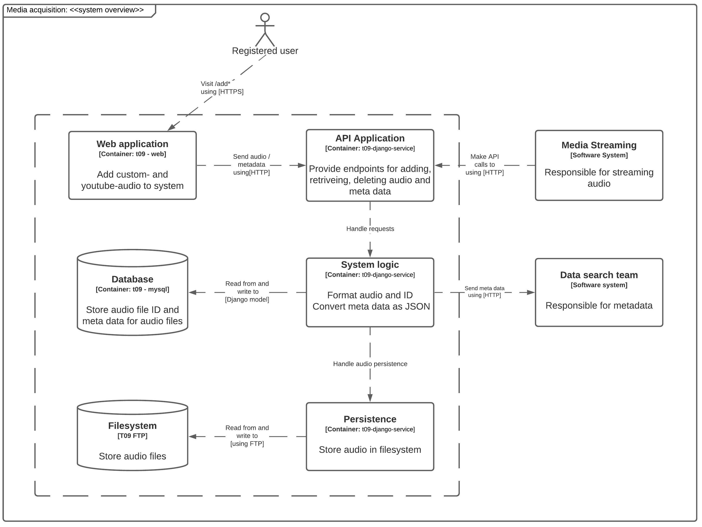
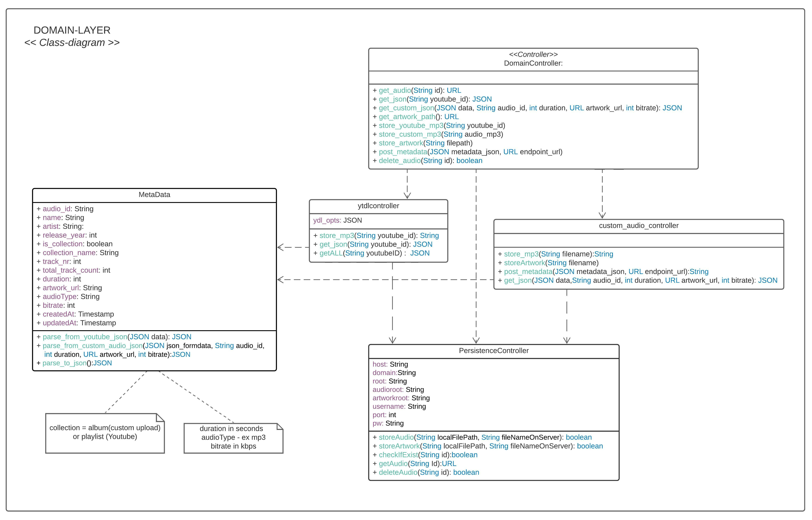
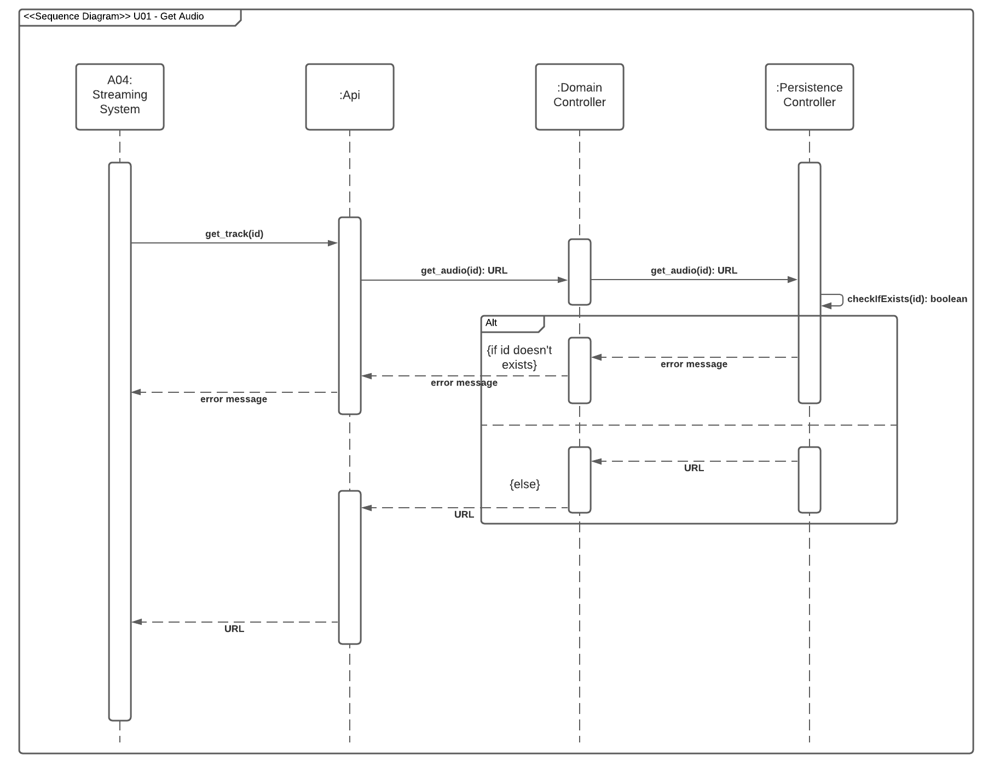
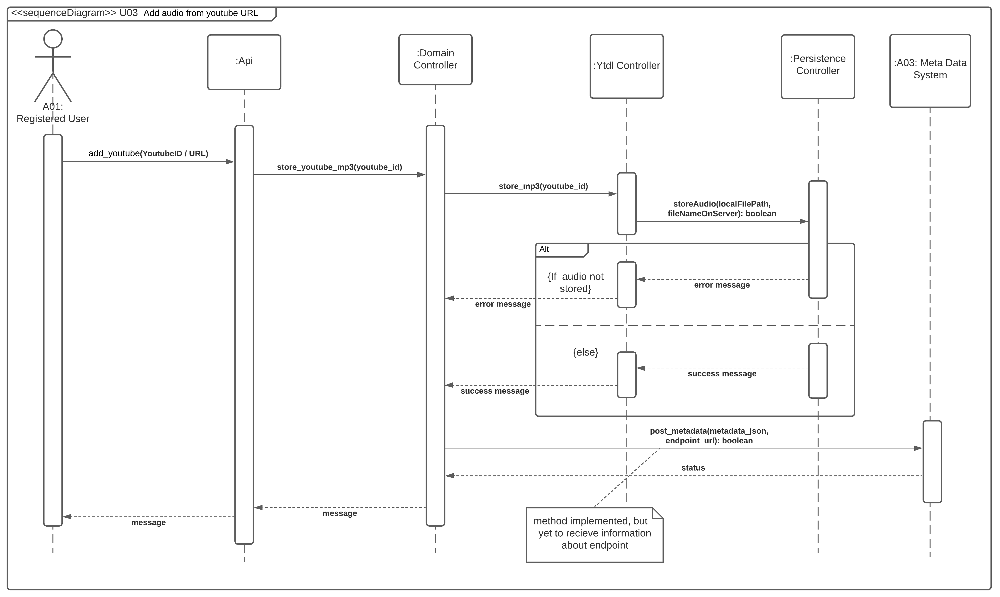
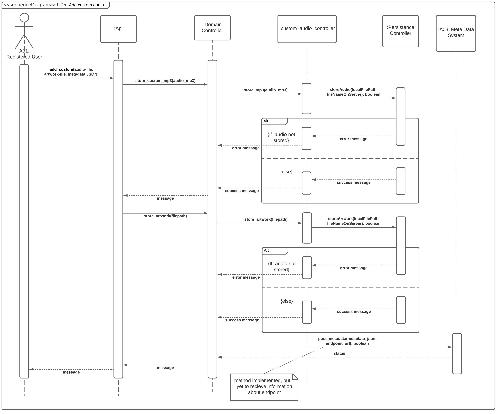
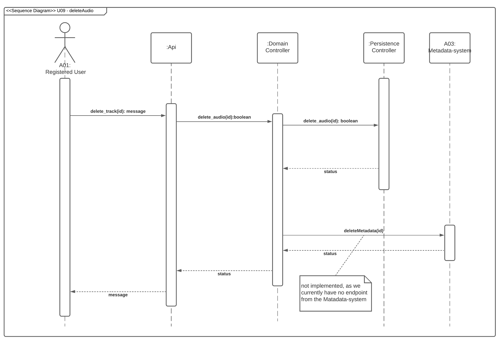

In this section a structural and behavioral view of the system is presented in a collection of diagrams to illustrate how the most important parts of the system work and interact.

## Choice of language and frameworks

Python is chosen as the language of this sub-system as the [YT_DLP](https://github.com/yt-dlp/yt-dlp) repository was found during the analytical phase is written i python. It is an open-source repository for a YouTube downloader that can download youtube videos, extract the audio to mp3 files, and download metadata. As It makes little sense to reinvent this function the team will import this functionality.\
\
To handle the API’s and database connection of this sub-system, The Django REST web framework was chosen over other frameworks. This is because it is a python framework and due to prior knowledge about it. The framework has been designed to - among other things - develop web API’s and it has a lot of solid documentation behind it. Moreover Django holds a lot of functionality for database connections, as well as ORM, which makes the database part of the sub-system easier to implement.

## Architecture

The System Overview Diagram shows an overview of the system parts including which containers they belong to, and how they interact with each other.

The user interface is a web application with two websites, one page for uploading custom audio, and one for youtube audio. It runs in its own container and contacts the system through the API. \
\
The main system logic is divided into three parts, but are located in the same container.

* Api Application: handles requests to the system, where the Django framework is used.
* System logic handles formatting of audio and metadata.
* Persistence responsible for storing and retrieving audio from the filesystem.

The storage of files are done in a filesystem using FTP, and metadata is stored in a mysql database running in its own container. \
\
This architecture creates low coupling between the elements, making it easy to replace parts of the system if desired, which makes the system easier to maintain. Scalability is achieved by running the system in multiple containers, so it can scale according to load. Other software systems that interact with this system do so through the API, in that way the inner system logic is hidden for external services.

## **UML Class Diagram**

A static view of the System Logic and Persistence Logic from the overview diagram is presented in the following class diagram.

The Domain Controller is responsible for distribution method calls from the API to the other parts of the system. The custom_audio_controller and ytdlcontroller classes are respectively responsible for receiving metadata and local storage of files from custom audio uploads and audio downloaded from YouTube. The metadata class handles formatting of metadata received from either a custom upload or from a YouTube download, so the data can be presented in a uniform way. Persistence Controller is responsible for storing audio files on the file server via FTP.

## Sequence Diagrams

This section shows sequence diagrams of the main use-cases U01, U03, U05 and U09 representing the backbone of the system. These use cases are selected for further description.

#### **Sequence diagram for U01 Get Audio**

This diagram shows the flow in the system when a request is made to the API to get an URL for a specified audio ID.

When requesting the API to get the URL for a song through the get_track endpoint, the API will call the get_audio method in the Domain Controller, which will distribute the call to the Persistence Controller. If the requested ID exists, it will return an URL, otherwise an error message is returned.

#### **Sequence diagram for U03 Add audio from youtube URL**

This diagram shows the flow in the system when a user wants to add a song from YouTube to the system.

The user sends a request to the API to the add_youtube endpoint. The API will call the store_youtube_mp3 method in the Domain Controller which will call the ytdlcontroller that handles download of audio files and metadata. The file is stored in the filesystem through the persistence controller, which will return a status message if storing was successful.

#### **Sequence diagram for U05 Add custom audio**

This diagram describes the flow in the system when a user wants to add custom audio to the system.

The functionality when a user requests to add a song to the system from a local computer, through the add_custom endpoint works in a similar way as the [U03 Add audio from YouTube URL.](https://gitlab.sdu.dk/semester-project-e2021/team-09/media-acquisition/-/wikis/4.-Design#sequence-diagram-for-u03-add-audio-from-youtube-url) The main difference is the system also handles storage of artwork, as can be seen when the domain controller calls the store_artwork method.

#### **Sequence diagram for U09 delete audio**

This diagram shows the flow of events when a registered user requests to delete a song through the delete_track API endpoint.

The API calls the delete_audio on the domain controller, which forwards the call to the Persistence Controller. It deletes the mp3 file from the file system along with the metadata in the database and returns a status.