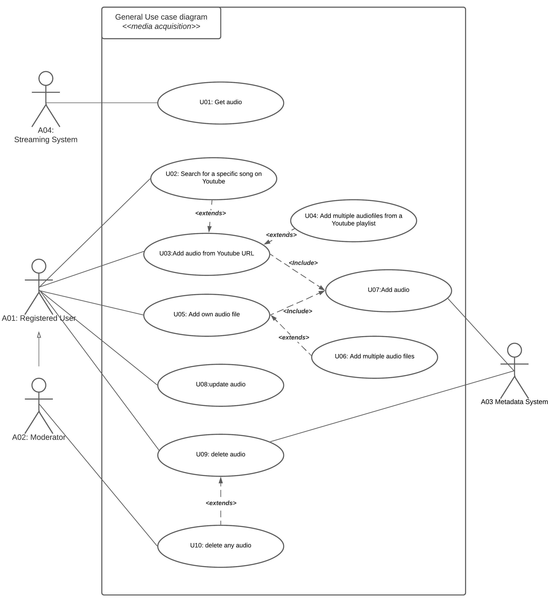

An analysis is done to extract the requirements that form the base of the system from the overall requirement for this sub-system. This is accomplished by investigating existing solutions, best practices and by a use-case analysis.

### **1.1 File handling** 

The project description states a need for a solution for adding and retrieving audio files to and from the system. Therefore, this sub-part of the system should download and store audio files added from YouTube or by users as original work. Metadata corresponding to these audio files should also be stored, for other teams to use our service, and to recover metadata in case of inconsistency with other services.

### **1.2 Interface design** 

The design of the user interface for adding audio files should be simple and intuitive. Users of the system will typically be experienced with other similar systems such as YouTube, Spotify, Soundcloud and YouTube to MP3 converters. Therefore it is a good idea for this system to have similar features: Eg. uploading multiple files at once and uploading meta-data along with the file. Other features, which the users are accustomed to, could be searching for specific YouTube videos and using pre-made playlists on YouTube. These features serve to make the system user-friendly and intuitive.

### **1.3 Communication**

As this project is a sub-system of a bigger application it should be possible for the system to communicate with other subsystems. This communication entails the transfer of audio files and metadata to other subsystems. Handling of the acquired data should be outsourced to other subsystems, acquiring separation of concern. This communication will be exposed through a REST API, as it is an industry standard, soit will make our system accessible without exposing the system logic.

### **1.4 Storage**

**Storage type**

According to Maxim Orlov [(maximorlov.com, Visited on 10.10.2021)](https://maximorlov.com/why-storing-files-database-bad-practice/), best practices for storing a big quantity of large files is storing them in a file system. In order to query the metadata, a relational database is used, as it is the fast way to retrieve the information. The database will store metadata as a JSON file, with the id corresponding to the audio file. This is an optimal solution, as filesystems are optimized for storing, retrieving and indexing files, and a relational database for querying metadata.

**Scaling**

As it is expected that the user base of the service should be able to scale to millions within the first two years, the storage should be able to scale as needed. If not scalable, it’s not possible to meet expectations of availability for the system, which is crucial to the users. The response time will become slow or in the worst case the service will become unavailable.

**Data verification**

The data storage should be as optimized as possible to avoid problems with unnecessary data in the database. Methods to accomplish this could be:

- Detecting if a specific audio file already exists in the system.
- Verifying files to make sure they aren’t corrupt. Corrupted audio files will have a structure not expected by the system and will not be playable.
- Verifying that an upload from a personal computer is no bigger than 128GB, as this is also the limit on YouTube.
- The the system should verify that files added contain audio files.

**Audioformat**

Audio is saved in mp3 format with a bitrate of 126 kbps - equivalent to the highest possible audio quality in YouTube. [(Kevin Arrows, Visited on 10.10.2021)](https://appuals.com/why-converting-youtube-to-320kbps-mp3-is-a-waste-of-time/)

### **1.5 Security**

It is vital to restrict access to the storage system of audio files. Otherwise it can pose a serious threat regarding the integrity of data, as well as misuse of the storage system. This sub-system relies heavily on the work of the Connection Security sub-system to ensure that no unauthorized access is possible.

The different actors of the system need to have clearly defined constraints on their access rights to the system: Admin(s) should have full CRUD access to everything in the file system, whereas registered users should only have CRUD access to their own submitted files.

There should be a report function for each uploaded audio file, so the moderator can know which audio files to remove from the system. This is necessary to uphold a certain quality of the content of the system as it could be flooded with non music files and inappropriate content.

## **Use-case analysis**

To retrieve the functional requirements to the system an use case analysis is conducted including a use case diagram, actor and use case description and a detailed description of selected core use cases.

### **Use Case Diagram**

### **List of Actors**

The primary actors are:

* A registered user with privileges to add audio to the system, update and delete own data.
* A moderator has access to all data, and needs to verify all data in the system.
* The streaming system, which saves the added audio files in the system.

A Secondary actor is the Meta-data System that handles storage of meta-data.

<table>
<tr>
<th>#ID</th>
<th>Name</th>
<th>Description: Goal</th>
</tr>
<tr>
<td>A01</td>
<td>Registered User</td>
<td>

A Registered User should be able to:

* Add audio - either locally or from youtube link
* Search for a specific song on Youtube for adding to the system
* Update and delete locally uploaded files
</td>
</tr>
<tr>
<td>A02</td>
<td>Moderator</td>
<td>

A moderator should be able to:

* Delete any audio in the system.
</td>
</tr>
<tr>
<td>A03</td>
<td>Metadata-system</td>
<td>

Metadata-system should:

* Receive notifications when audio is deleted from the system
* Receive metadata when audio is added to the system.
</td>
</tr>
<tr>
<td>A04</td>
<td>Streaming-system</td>
<td>

Streaming-system should:

* Read/Get audio files in the system
</td>
</tr>
</table>

---

### **List of Use Cases**

All use cases are listed in the diagram below
| #ID | Name | Description | Actor |
|-----|------|-------------|-------|
| U01 | Get Audio | Get an audio file for a given song, requested by the actor. | A04 |
| U02 | Search for a specific song on Youtube | It should be possible to search the system for specific artists, songs, albums or EP’s. | A01 |
| U03 | Add audio from youtube URL | It should be possible to add audio files by passing a youtube link to the system. | A01 |
| U04 | Add multiple audio files from a Youtube Playlist | It should be possible to parse a youtube playlist url, and extract all audio files from the videos it contains. | A01 |
| U05 | Add own audio file | It should be possible to add locally stored audio files. | A01 |
| U06 | Add multiple audio files | It should be possible for a user to upload multiple audio files. | A01 |
| U07 | Add audio | It should be possible to add audio files. | A01 |
| U08 | Update audio | It should be possible to update own submitted audio files. | A01 |
| U09 | Delete own audio | It should be possible to delete own submitted audio files. | A01 |
| U10 | Delete any audio | It should be possible to Delete any audio file, uploaded by any user. | A02 |

---

### **Detailed Use Case Description**

The core functionality of the system is reading, adding, and deleting audio files from the system. This functionality is described in the use-cases U01, U03, U05 and U09, therefore these use-cases are selected and described in detail below.

<table>
<tr>
<th>Use Case: Get Audio</th>
</tr>
<tr>
<td>

**ID:** U01
</td>
</tr>
<tr>
<td>

**Primary Actor:** A04 - Streaming System
</td>
</tr>
<tr>
<td>

**Secondary Actor:** None
</td>
</tr>
<tr>
<td>

**Short Description:** Get an audio file for a given song, requested by actor A04 - Streaming System
</td>
</tr>
<tr>
<td>

**Pre conditions:**

* An audio file must exist in the system
* The actor A04 must be authorised to access the system
</td>
</tr>
<tr>
<td>

**Main Flow:**

1. This use case starts when the Streaming System wants access to an audio file.
2. The Streaming system provides an id for the desired audiofile
3. The system checks if an audiofile with the given ud exist
4. The system finds the related audio file
5. The system delivers the given audio file to the given actor (A04 - Streaming System)
</td>
</tr>
<tr>
<td>

**Post conditions:** An audiofile has been received from the system
</td>
</tr>
<tr>
<td>

**Alternative Flow:**

1. @3 If the file doesn’t exist, the actor is notified
</td>
</tr>
</table>

---

<table>
<tr>
<th>

**Use Case:** Add audio from youtube URL
</th>
</tr>
<tr>
<td>

**ID:** U03
</td>
</tr>
<tr>
<td>

**Primary Actor:** A01 - Registered user
</td>
</tr>
<tr>
<td>

**Secondary Actor:** A03 - Metadata-System
</td>
</tr>
<tr>
<td>

**Short Description:** It should be possible to add audio files by passing a youtube link to the system. The link can either by the direct url, or a unique youtube ID
</td>
</tr>
<tr>
<td>

**Pre conditions:** The user will have to be authenticated before.
</td>
</tr>
<tr>
<td>

**Main Flow:**

1. This user wishes to add a song from a youtube url or unique YouTube ID
2. The user applies the url or ID to the system.
3. The system searches the Youtube API for the URL
4. The system checks if the link or UD exists
5. The system downloads the mp3 file
6. The metadata attached to the youtube video is parsed
7. Metadata is transferred to the Meta-Data system (A03)
8. The system stores the mp3 with the Youtube id as a filename
9. The system sends notification to the Registered user (A01) that the audio file has been added
</td>
</tr>
<tr>
<td>

**Post conditions:** New audio file has been added to the system from Youtube API.
</td>
</tr>
<tr>
<td>

**Alternative Flow:**

1. @2 If the youtube URL contains a playlist, all of the songs on that playlist will be downloaded to the file system, see use case U04 add audio from playlist.
2. @4 If the url passed is not found, the use-case is aborted and the system returns an error message to the user.
3. @5-8 if an error occurs between downloading and transferring data, the use-case is aborted and the system returns an error message to the user.
</td>
</tr>
</table>

---

<table>
<tr>
<th>

**Use Case:** Add own audio file
</th>
</tr>
<tr>
<td>

**ID:** U05
</td>
</tr>
<tr>
<td>

**Primary Actor:** A01 - Registered user
</td>
</tr>
<tr>
<td>

**Secondary Actor:** A03 - Metadata-System
</td>
</tr>
<tr>
<td>

**Short Description:** It should be possible to upload audio files to the system from a personal computer.
</td>
</tr>
<tr>
<td>

**Pre conditions:** The user will have to be authenticated beforehand.
</td>
</tr>
<tr>
<td>

**Main Flow:**

1. The user wishes to add a locally stored audio file to the system
2. The user searches local storage and selects the file
3. The audio file is checked for correct file type (mp3)
4. The audio file size is checked to not exceed 128 gb
5. The user enters metadata specified in the form
6. The system checks the form before sending
7. The audio file is checked for any data corruption
8. The audio file is uploaded to the file system
9. The meta data is sent to metadata-system with the unique ID
</td>
</tr>
<tr>
<td>

**Post conditions:**

* New audio files added to the system.
* Metadata is sent to the metadata-system.
</td>
</tr>
<tr>
<td>

**Alternative Flow:**

1. @3: The audio file is incorrect format
2. @4: An error in the form occurred, user is prompted to re enter form
3. @4: The audio file’s size exceeds the limit.
4. @1-7: En error uploading file happened. User is prompted with an error message.
</td>
</tr>
</table>

---

<table>
<tr>
<th>

**Use Case:** Delete Audio
</th>
</tr>
<tr>
<td>

**ID:** U09
</td>
</tr>
<tr>
<td>

**Primary Actor:** A01 - Registered User
</td>
</tr>
<tr>
<td>

**Secondary Actor:** A03 - Metadata-System
</td>
</tr>
<tr>
<td>

**Short Description:** A registered user should be able to delete audio files uploaded by the same user.
</td>
</tr>
<tr>
<td>

**Pre conditions:** A user has uploaded audio that’s currently present in the system.
</td>
</tr>
<tr>
<td>

**Main Flow:**

1. An actor finds the audio files he currently has uploaded in the system
2. The actor selects a specific song he wishes to delete
3. The actor deletes the file
4. The system removes the file from the file system
5. The system notifies the actor A03 (metadata-system) that the given file has been deleted
6. The system notifies the actor the deletion is successful
</td>
</tr>
<tr>
<td>

**Post conditions:**

* The given audio file is no longer present in the system.
* Metadata-system has received a notification that the audio file has been deleted.
</td>
</tr>
<tr>
<td>

**Alternative Flow:**

1. @3-5 If the deletion fails, the actor is notified.
2. @3-5 The deletion fails if the file has already been deleted from the system.
</td>
</tr>
</table>

---