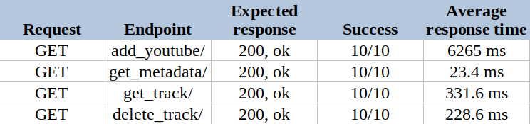
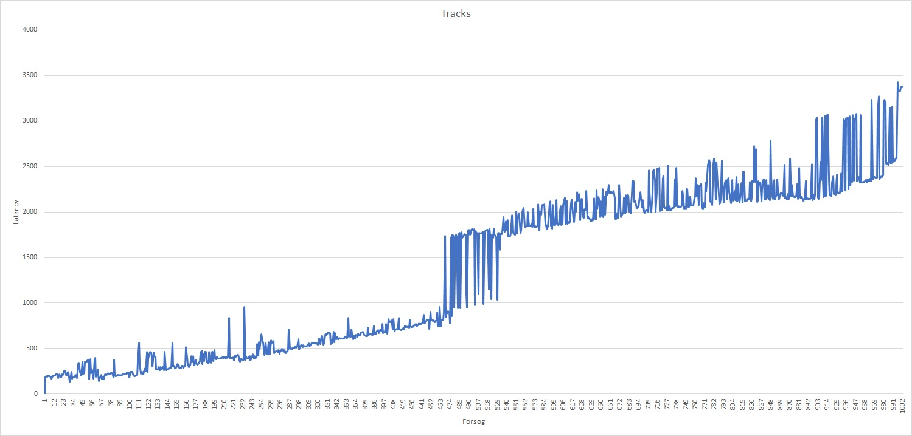
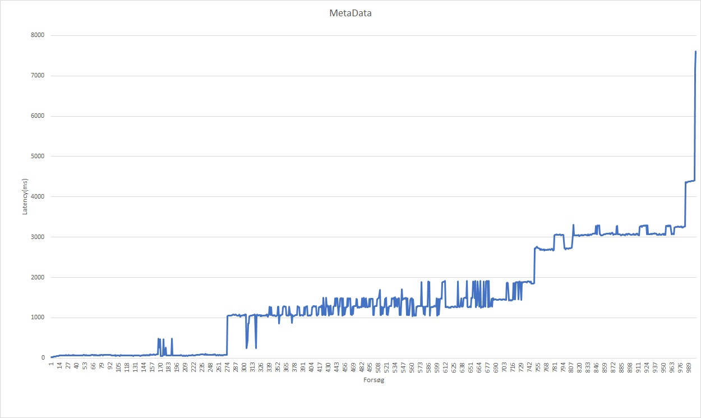

<span dir="">This section is dedicated to demonstrate the measurability and validation of the requirements to this sub-system. This will be done through tests which have been performed on the system - both in functionality through system testing and load and stress through performance testing - benchmarking the solution. </span>

<span dir="">The results of the test presented here give an overview of what the end-product of this sub-system can do and withstand.</span>

# Testing

## **<span dir="">System Testing</span>**

<span dir="">The tests used for system testing only communicate with the system through the api. The system tests are not stateless, and are dependent on each other. This way, it's possible to use one test verifies the uploading functionality, and another test uses the uploaded file, to test the retrieval of files from the system.</span>

<span dir="">The tests are written using the unittest library.</span>

<span dir="">An example of a test, responsible for testing the response from an invalid url endpoint:</span>

```
def test_get_invalid_api_url(self):
       endpoint = "/invalid_endpoint/"
       url = API_URL + endpoint
 
       r = requests.get(url)
       self.assertEqual(404, r.status_code)
```

<span dir="">The test firstly defines the endpoint, and the full url. The full URL is used to create a get request on the API, where it asserts if the status code is equal to 404.</span>

### **<span dir="">Test 1:</span>** <span dir="">API</span>
| Requirements tested |
|---------------------|
| **F4:** The media acquisition sub-system must be accessible to other parts of the audio streaming service. <br>**F4.1** The system must have an API so other parts of the system can read its data. |
| **Goal:** Use the API endpoints and assert if the response is as expected. |
| **Description and expected results** |
| The system tests done in this section are all contributing to assert this requirement. Other tests not correlating directly to requirements are done in this test section. One API endpoint gets all tracks in the system. The tests call this endpoint, expecting the result to be an empty list. Another row of tests calls invalid endpoints and sends invalid get and post requests, and asserts the response code is 404 and the correct error message is received. |
| **Result:** Passed |

### **Test 2:** Upload custom audio file

<table>
<tr>
<th>Requirements tested</th>
</tr>
<tr>
<td>

**F1.1:** It must be possible to add audio files from a personal computer. <br>**F1.1.1:** <span dir="">It must be possible to add meta-data along with the audio file.</span>
</td>
</tr>
<tr>
<td>

**Goal:** Assert that a custom audio file with custom metadata is uploaded correctly to the server, by retrieving it again.
</td>
</tr>
<tr>
<td>

**Description and expected results**
</td>
</tr>
<tr>
<td>

<span dir="">This test consists of two individual tests, upload a song and assert if it has been deleted.</span>

1. <span dir="">Upload a custom song to the FT</span>P\
   \- <span dir="">compiling an mp3 file, an artfile and a metadata file, into a HTTP post request. </span>\
   \- <span dir="">execute request and assert request code is 200, and response body is as expected.</span>
2. <span dir="">Executes a GET request on the “get_track/” endpoint with the ID of the uploaded audio file, and asserts the response code is 200, and that the ID can be found in the response body.</span>
</td>
</tr>
<tr>
<td>

**Result:** Passed
</td>
</tr>
</table>

### **<span dir="">Test 3:</span>** <span dir="">Remove audio files</span>

<table>
<tr>
<th>Requirements tested</th>
</tr>
<tr>
<td>

**F1.1.3:** It should be possible to remove audio files from the system.
</td>
</tr>
<tr>
<td>

**Goal:** A user should be able to remove audio files from the system, given they have a valid ID.
</td>
</tr>
<tr>
<td>

**Description and expected results**
</td>
</tr>
<tr>
<td>

This test is done in two almost identical parts. to assert that a complete deletion works for both YouTube and custom uploaded audio files, so the following steps are repeated for each type.

1. Upload audio file.
2. Delete the file.
3. Use the get-method to confirm that it has been deleted.
</td>
</tr>
<tr>
<td>

**Result:** Passed
</td>
</tr>
</table>

### **<span dir="">Test 4:</span>** <span dir="">Add audio files from a YouTube ID</span>

<table>
<tr>
<th>Requirements tested</th>
</tr>
<tr>
<td>

**F1.2:** It must be possible to add audio files from a YouTube ID.
</td>
</tr>
<tr>
<td>

**Goal:** To give the API endpoint a YouTube ID and assert that the audio of the YouTube video is uploaded correctly to the Database.
</td>
</tr>
<tr>
<td>

**Description and expected results**
</td>
</tr>
<tr>
<td>

This test adds an audio file to the system, and proceeds to fetch it, with the use of a YouTube UD.

1. Firstly the API endpoint “add_youtube/” is called, with the respective ID. 
2. When this is confirmed as a success, by asserting the status code and response message as expected.
3. The audio is retrieved with a get method, using the previous YouTube ID, on our “get_track/” endpoint. 
4. The test is confirmed a success by asserting that the response code is 200, and the YouTube ID is found in the response body.
</td>
</tr>
<tr>
<td>

**Result:** Passed
</td>
</tr>
</table>

### **<span dir="">Test 5:</span>** <span dir="">Store audio files</span>

<table>
<tr>
<th>Requirements tested</th>
</tr>
<tr>
<td>

**F3:** It must be possible to store audio files in the system <br>**F3.3:** It could be possible for the system to store MP3 files.
</td>
</tr>
<tr>
<td>

**Goal:** <span dir="">To assert that audio files are correctly stored in the system.</span>
</td>
</tr>
<tr>
<td>

**<span dir="">Description and expected results</span>**
</td>
</tr>
<tr>
<td>

<span dir="">This test checks if uploads from both custom audio and youtube are stored in the system.</span>

1. <span dir="">Uploading both a YouTube ID and a custom audio file to the system.</span>
2. <span dir="">For uploading the custom audio different HTTP post requests are created with a different combination of MP3 file, JPEG files, and a JSON metadata object</span>

* <span dir="">Without any missing components</span>
* <span dir="">Missing just the artfile</span>
* <span dir="">Missing the audio file</span>
* <span dir="">Missing the metadata</span>

<span dir="">It is asserted that the first two requests pass and the last two fail. </span>

3. <span dir="">For uploading the Youtube audio, the endpoint “add_youtube/” is called, with the respective ID. The test then asserts the status code is 200 and the response body as expected.</span>
4. <span dir="">The test uses the “get_track” endpoint to assert the requests. It uses both custom and YouTube audio, from their respective ID, and asserts that the response code is 200 and that the response body contains the ID of the audio file, followed by a .mp3.</span>
</td>
</tr>
<tr>
<td>

**Result:** Passed
</td>
</tr>
</table>

### **<span dir="">Test 6:</span>** <span dir="">Duplicate audio file uploads</span>

<table>
<tr>
<th>

**<span dir="">Requirements tested</span>**
</th>
</tr>
<tr>
<td>

**<span dir="">F3.1</span>** <span dir="">The system should be able to detect if a specific audio file already exists in it, based on the YouTube ID.</span>
</td>
</tr>
<tr>
<td>

**<span dir="">Goal</span>:** <span dir="">To assert, if the system checks for duplicate uploaded audio files from YouTube by the ID of the audio files.</span>
</td>
</tr>
<tr>
<td>

**<span dir="">Description and expected results</span>**
</td>
</tr>
<tr>
<td>

1. <span dir="">Add an audio file from a YouTube upload which already exists in the database </span>
2. <span dir="">Asserts that the response code is 404, and the response body as expected. </span>
3. <span dir="">Use the “get_all_tracks” endpoint, and asserts that the audio ID is present only once in the list of IDs.</span>
</td>
</tr>
<tr>
<td>

**<span dir="">Result:</span>** <span dir="">Passed</span>
</td>
</tr>
</table>

## **Performance testing**

<span dir="">To examine how the system behaves under certain types of conditions, for example a specific load, a test simulating 1000 users requesting the webserver is set up. </span>\
<span dir="">This is done by using the open source test software Jmeter, which simulates standard http requests. </span>

### **<span dir="">Test 7: Functional Load Testing</span>**

<table>
<tr>
<th>Goal</th>
</tr>
<tr>
<td>

<span dir="">Tests response time and latency of API on create, read, delete operations</span>
</td>
</tr>
<tr>
<td>

**<span dir="">Description and expected results</span>**
</td>
</tr>
<tr>
<td>

<span dir="">The test inserts 10 tracks into the system, tries to read the inserted data, then deletes. All requests should expect a 200 response.</span>
</td>
</tr>
<tr>
<td>

**<span dir="">Result:</span>**


</td>
</tr>
</table>

### **<span dir="">Test 8: Load Testing</span>**

<table>
<tr>
<th>Goal</th>
</tr>
<tr>
<td>

<span dir="">To evaluate system performance/functionality under load.</span>
</td>
</tr>
<tr>
<td>

**<span dir="">Description and expected results</span>**
</td>
</tr>
<tr>
<td>

<span dir=""> Tests functionality and availability on a workload of 1000 GET requests per second. </span>

<span dir=""> All requests should expect a 200 response.</span>
</td>
</tr>
<tr>
<td>

**<span dir="">Result:</span>**

<span dir="">Different test results will differ from each other depending on the setting of the environment. As our services only have a limited amount of computer resources when hosted on the cluster, the load was actually more stable in a local setting. If we measure the latency between message and response on 1000 GET requests per second on the endpoints /get_metadata/ and /get_track/, we can clearly see the breaking points between the amount of requests per second and the latency time, thus demonstrating load on the system. This implies that our Django image will have to be scaled up across more machines to distribute the load. </span>

<span dir="">Bottlenecks: The system's capacity is primarily limited by the external file system and the system resources.</span>
</td>
</tr>
</table>



<span dir="">Graph 1: measures latency on 1000 GET requests per 1 second on endpoint get_track/.</span>



<span dir="">Graph 2: measure latency on 1000 GET requests on endpoint get_metadata/</span>